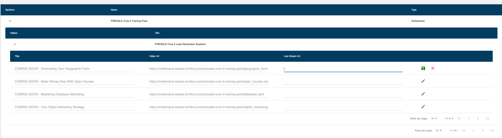

# tf_table
This table is build with React + Material UI. And Server Side sorting/searching/pagination is a requirement.

The table will send send the server pagination GET parameters 'rowPerPage, page, search'
it is the job of the backend to return a json response with response.items : [{}, {}] and response.total : Int


````
example re-usable code with laravel eloquent

$eloquentBuilder = Model::where('product_id', 5)
    ->bySearch($request->get('search', null)) //have a method that will handle search fields for this model
    ->with('relation');
    
    //use a helper to paginate the query builder
$total = PaginationHelper::handlePaginateGetCount($attendeeBuilder, $request->all()); 

return response()->json(['items' => $attendeeBuilder->get(), 'total' => $total]);
````
````
Each table only requires a 
1) configuration object
2) pass the configured http/axios client from the app. (Maybe request require authorization, which is controlled by the http client's headers)
 
and a ref if you want to search the remote database when a search value is set

refs can be helpful for other use cases other than searching like refreshing the table before closing an external modal to save the record
ie: this.table.refresh()
````
````
Example 1:

Custom Action/Controls with custom React components
custom data formatting, nested data (. dot) notation, with searchBar(not included), 
sort specific columns, assign column to be sorted in a specific direction by default
how to handle search with refs
````

````
Example 1 Code:

import TfTable from 'tf_table/src/TfTable';
 constructor(props) {
  this.table = React.createRef();
  
  this.tableConfig = {
    dataUrl: route('get-event-attendees', {product: this.props.location.pathname.split("/")[4]}),
    tableHeaderColumn: {
      style: {
        color: 'black',
        fontSize: 14,
      }
    },
    columns: [
      {
        header: 'Name',
        prop: ['first_name__c', 'last_name__c'],
        propValueFormat: (items) => `${items[0]} ${items[1]}`,
        sort: true,
        initialSortOrderByDirection: 'asc'
      },
      {
        header: 'Email',
        prop: 'email__c',
        sort: true,
      },
      {
        header: 'Status',
        prop: 'status__c',
        sort: true,
      },
      {
        header: 'Location',
        prop: ['relation.mailingcity', 'relation.mailingstate'],
        propValueFormat: (items) => `${items[0]}, ${items[1]}`,
      },
      {
        header: 'Registration Type',
        prop: 'contact.registration_type__c',
        defaultPropValue: 'General Admission',
      },
      {
        header: '',
        type: 'Custom',
        render: (item, column, classes) => {
          return (
            <div className={classes.buttonContainer}>
              <Button
                variant={"outlined"}
                color="primary"
                className={classes.tableButton}
                onClick={() => this.openModal(item)}
              >
                Edit
              </Button>
            </div>
          )
        }
      },
    ]
  };
}
````
````    
<TimeoutSearchBar
  placeholder={'Search attendees'}
  timeoutFunction={value => this.table.search({search: value})}
/>
<TfTable
  innerRef={node => this.attendeeTable = node}
  config={this.tableConfig}
  axios={this.tfservicesAxios}
  noResultsMessage={"No Results Found"}
/>
````

````
Example 2:

Nested Tables, editing columns in a row/db record in place. The table will save the record to the endpoint provided by the user
Using Multiple built in Material UI Datagrid controls, with callback.
````

````
Example 2 Code:

this.videosConfig = {
  tableHeaderRow: {
    styleKey: 'tableHeadDarcula'
  },
  canEditExistingItems: true,
  dataUrl: route('get-section-videos'),
  columns: [
    {
      header: 'Title',
      prop: 'title',
      canEdit: false,
      type: 'TextField'
    },
    {
      header: 'Video Url',
      prop: 'video_url',
      canEdit: false,
      type: 'TextField'
    },
    {
      header: 'Live Stream Url',
      prop: 'live_stream_url',
      canEdit: true,
      type: 'TextField'
    },
    {
      header: '',
      type: 'Action Save',
      url: route('save-product-section-video')
    },
  ]
};

this.sectionConfig = {
  tableHeaderRow: {
    styleKey: 'tableHeadDarcula'
  },
  dataUrl: route('get-product-sections'),
  columns: [
    {
      header: 'Videos',
      expandableConfig: this.videosConfig,
    },
    {
      header: 'Title',
      prop: 'section',
      canEdit: false,
      type: 'input'
    },
  ]
}

this.tableConfig = {
  tableHeaderRow: {
    styleKey: 'tableHeadDarcula'
  },
  dataUrl: route('get-ondemand-products'),
  columns: [
    {
      header: 'Sections',
      expandableConfig: this.sectionConfig,
    },
    {
      header: 'Name',
      prop: 'name',
      canEdit: false,
      type: 'input'
    },
    {
      header: 'Type',
      prop: 'family',
      canEdit: false,
      type: 'input'
    },
  ]
}
}
````
````
<TfTable 
  config={this.tableConfig}
  axios={this.tfservicesAxios} 
/>
````
