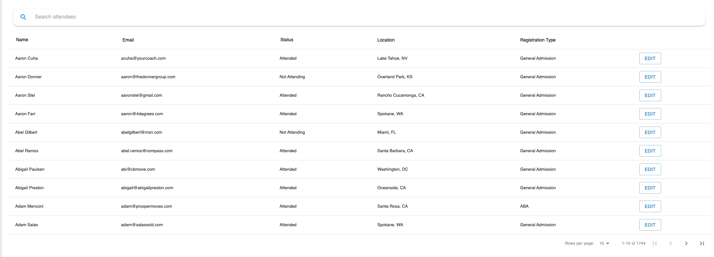

# tf_table

##Custom Action Buttons/callbacks, 
##custom data formatting, nested data (. dot) notation, with searchBar(not included), 
##sort specific columns, assign column to be sorted in a specific direction by default
###how to handle search with refs
````
import TfTable from 'tf_table/src/TfTable';


 constructor(props) {
  this.table = React.createRef();
  
  this.tableConfig = {
    dataUrl: route('get-event-attendees', {product: this.props.location.pathname.split("/")[4]}),
    tableHeaderColumn: {
      style: {
        color: 'black',
        fontSize: 14,
      }
    },
    columns: [
      {
        header: 'Name',
        prop: ['first_name__c', 'last_name__c'],
        propValueFormat: (items) => `${items[0]} ${items[1]}`,
        sort: true,
        initialSortOrderByDirection: 'asc'
      },
      {
        header: 'Email',
        prop: 'email__c',
        sort: true,
      },
      {
        header: 'Status',
        prop: 'status__c',
        sort: true,
      },
      {
        header: 'Location',
        prop: ['contact.mailingcity', 'contact.mailingstate'],
        propValueFormat: (items) => `${items[0]}, ${items[1]}`,
      },
      {
        header: 'Registration Type',
        prop: 'contact.registration_type__c',
        defaultPropValue: 'General Admission',
      },
      {
        header: '',
        type: 'Custom',
        render: (item, column, classes) => {
          return (
            <div className={classes.buttonContainer}>
              <Button
                variant={"outlined"}
                color="primary"
                className={classes.tableButton}
                onClick={() => this.openModal(item)}
              >
                Edit
              </Button>
            </div>
          )
        }
      },
    ]
  };
}
````
````    
<TimeoutSearchBar
  placeholder={'Search attendees'}
  timeoutFunction={value => this.table.search({search: value})}
/>
<TfTable
  innerRef={node => this.attendeeTable = node}
  config={this.tableConfig}
  axios={this.tfservicesAxios}
  noResultsMessage={"No Attendees Found"}
/>
````



